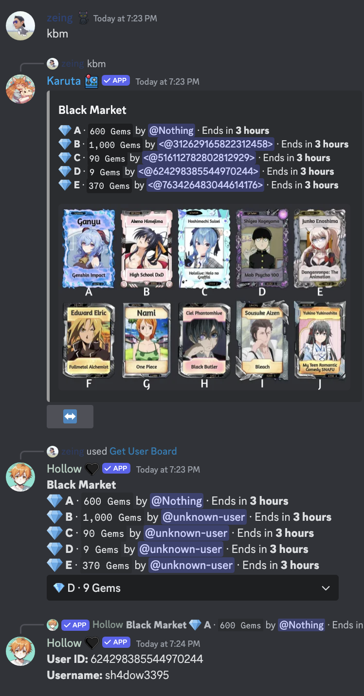

# Features

### **POG Drop Ping (Premium)**

I say q wishlist of cards if somebody drops a card over **100 WL**.


**How to subscribe premium**, Contact **zeing#6498 **in [Support Server](https://discord.gg/zTcaPARjfb).


#### How's work?

* subscribe your server to premium.
* Don't do setup anything for this feature, The bot will ping you when **POG** drop (**100 WL+ now**).


How's different between **Server Drop** and **User Drop.**

* **Server Drop => **Ping with Role (<mark style="color:green;">**@A LOT OF WISHLISTS**</mark>)
* **User Drop => **Only** **Ping&#x20;



**TIP:** about <mark style="color:green;">**@A LOT OF WISHLISTS**</mark>** **Role. You can give it to members for getting ping when **Server Drop.**


### **Starboard**


**How to check** starboard setting, Just type **`/starboard-status`**

It displays 1. Starboard Channel 2. is active for auto 3. minimum wishlist which you want to add to starboard

.png>)


**How to Setup**

1. Type `/set starboard` **select** #channel which you want to make starboard channel.

.png>)

2\. Then reply to the **Karuta Drop** message with `estar`.

3\. See in **Starboard** channel which you selected

.png>)

### **Auto Add to Starboard (Premium)**

It's easy to add starboard when **Karuta** drops a card that has a wishlist more than your minimum wishlist setting.


**How to check** starboard setting, Just type **`/starboard-status`**

It displays 1. Starboard Channel 2. is active for auto 3. minimum wishlist which you want to add to starboard

.png>)


**How to Setup**

1. Type `/set starboard`&#x20;
   1. **select** #channel which you want to make starboard channel.&#x20;
   2. **set** active when you want to auto add.
   3. **set **number of minimum wishlists which you want to add.

.png>)

### Searching


**Supported** `Card Collection,Inventory,Dye Collection`


You can search by **`keyword`** for getting code, just open and react 🔎

.png>)

**For Example** =>

* Type `4ft` you will get `4ft5jp,4ft55z`
* Type `genshin` you will get `4ft5jp`
* Type `2492` you will get `4fgs4j`

### Searching For Get Character Name


For **non-premium** servers, you must add the 👱‍♂️ reaction manually.


It seems like Searching to Code but You will get **Character Name** Instead

**For Example** =>

* Type `4ft` you will get `Yoimiya,Cynthia Moore`
* Type `genshin` you will get `Yoimiya`
* Type `2492` you will get `Rika Hoshizaki`

### Generate node command for working

generate results like **kjw node abcde** &#x20;

the node which you want, just open **Nodes Overview** (`knodes`) and react 👷‍♂️

.png>)

### Bits Summation (Premium)


For **non-premium** servers, you must add the :printer: reaction manually.


.png>)


**TIP: **If you want to sum all nodes (2 pages) just react :printer: then change to 2nd page

it will sum all nodes


### Wishlist Ping

.png>)


**For User: **You can use **/role wishlist-drop-watch active:True **(slash command) to enable

And when you want to disable just use **/role wishlist-drop-watch active:False**



**For ADMIN: **First of all admin use enable this feature in the server by **/set wishlist-drop-watch active:True **

If you want to disable ping in your server  **/set wishlist-drop-watch active:False **


### Server Drop Ping

.png>)


**For User: **You can use **/role server-drop-watch active:True **(slash command) to enable

And when you want to disable just use **/role server-drop-watch active:False**



**For ADMIN: **First of all admin use enable this feature in the server by **/set server-drop-watch active:True **

If you want to disable ping in your server  **/set server-drop-watch active:False **

